# 软件工程实践1
## 1. 阅读和理解样例代码
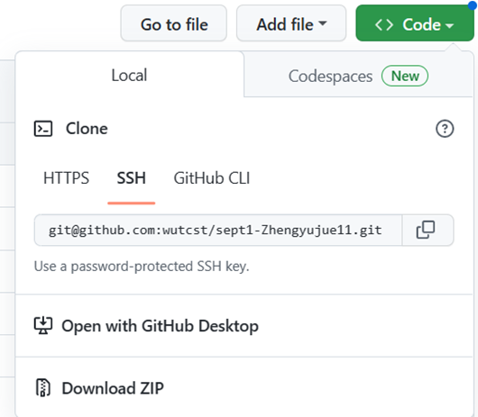
#### 在github里面，Code下点击Download ZIP获得老师初始给的代码框架。
#### 然后通过阅读代码利用XMind画出结构图
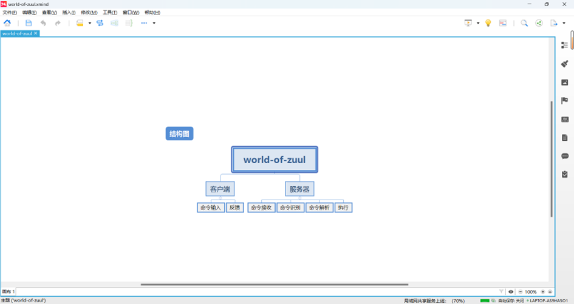
#### 之后利用IntelliJ IDEA 2022.1.1自带的类图工具结合亿图图示，绘制出类图
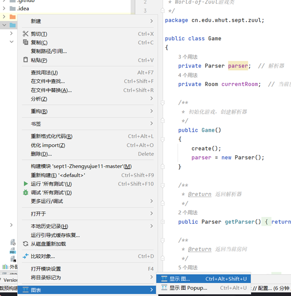
#### 亿图图示
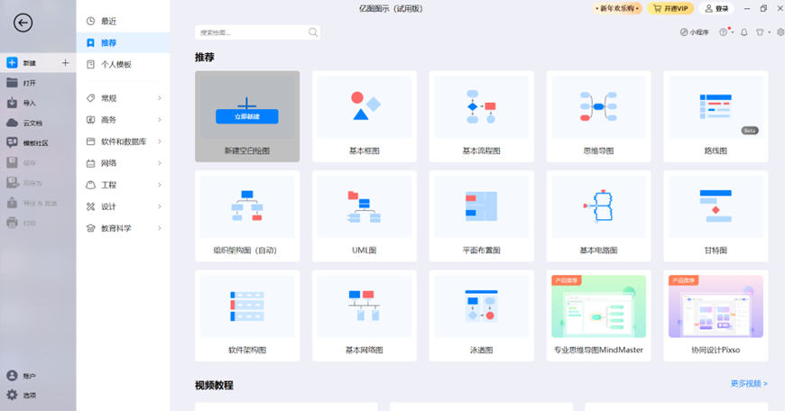
#### 最终效果
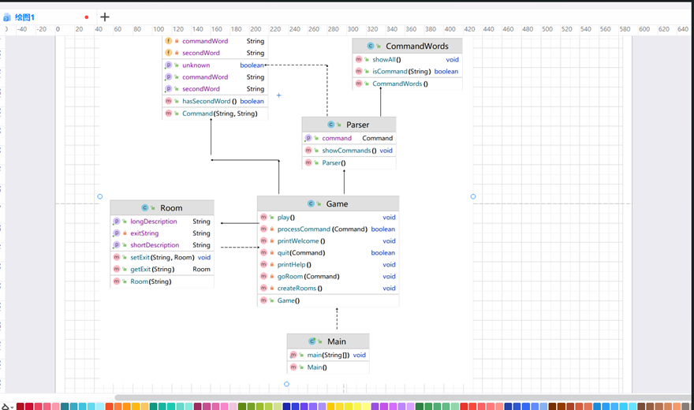
## 2. 标注样例工程中的代码
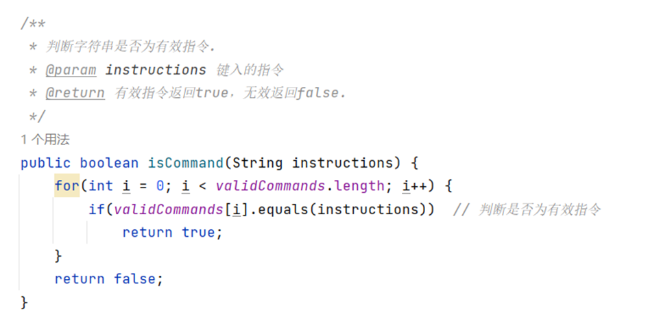
#### 类似上图，使用/**然后回车就会自动生成注释，然后根据具体情况填充注释内容。填充过程中参考上分注释规范。
## 3. 改进和维护样例工程
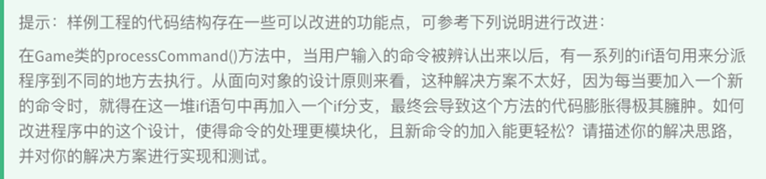
#### 由于之前没有接触过，所以查阅了相关资料，发现代码中存在多个 if-else语句，那么当项目中再增加多个有效指令时就会产生许多if-else，不仅代码不美观而且性能、安全性都比较差。因此可以采取策略模式来减少代码中的if-else语句，实现算法和具体上下文的分离。策略模式需要定义一个上下文对象Context、抽象的策略Strategy。
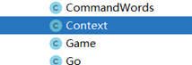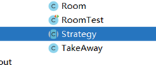
#### 具体的策略对象go
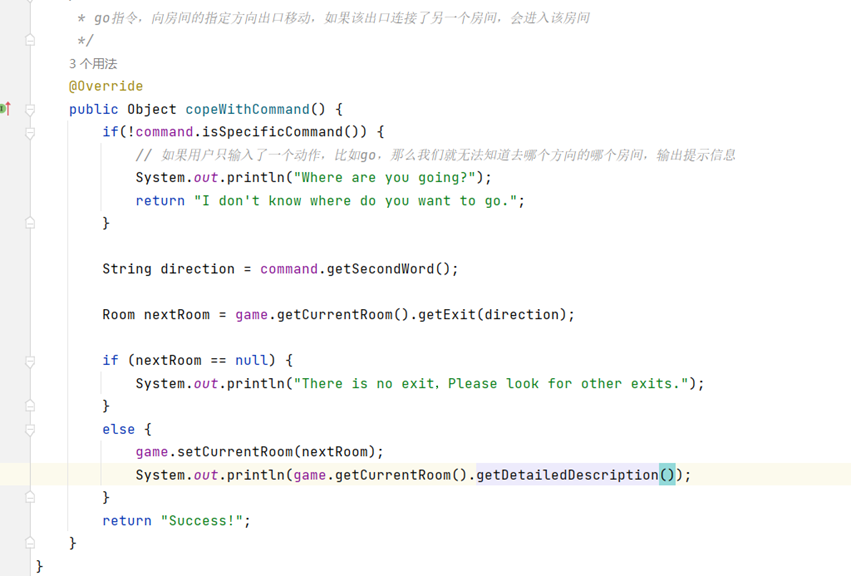
#### 具体的策略对象help
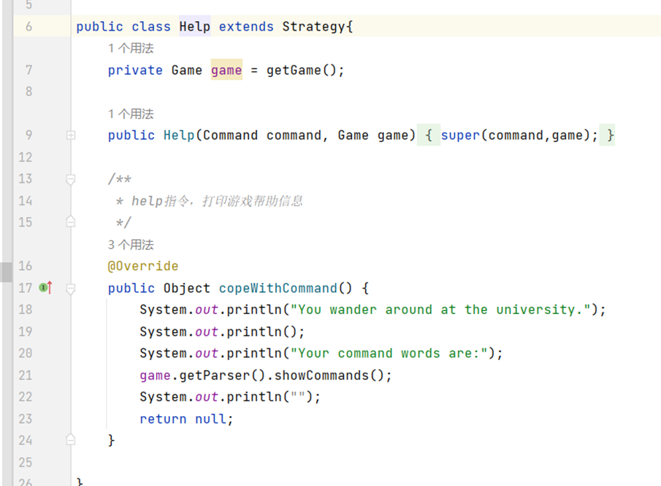
#### 优化前需要多个if-else，代码不美观，性能低，优化后只需要新增对应的策略，然后传入Command、Game对象即可。
## 4. 扩充样例功能 
#### 在Goods类中增加了物品重量
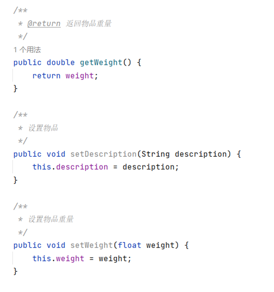
#### 在游戏中增加了back命令，可以回到上一个地方
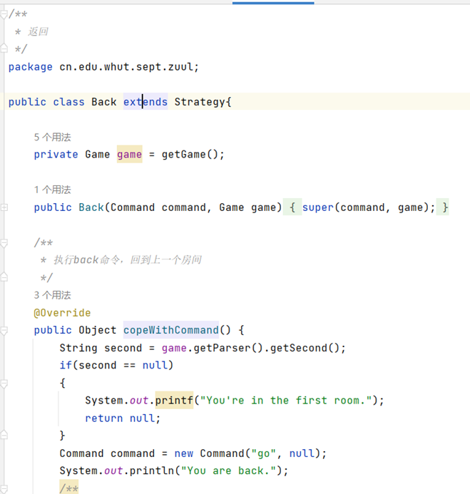
#### 增加了takeaway功能
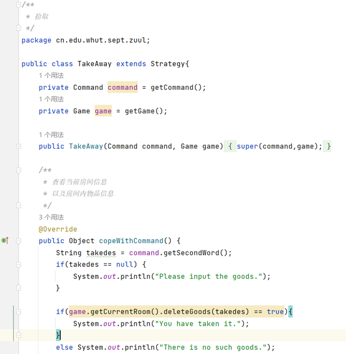
## 5. 编写测试用例
#### 对于quit测试
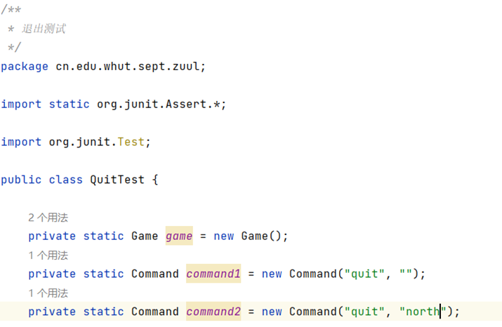
#### 对于room类测试
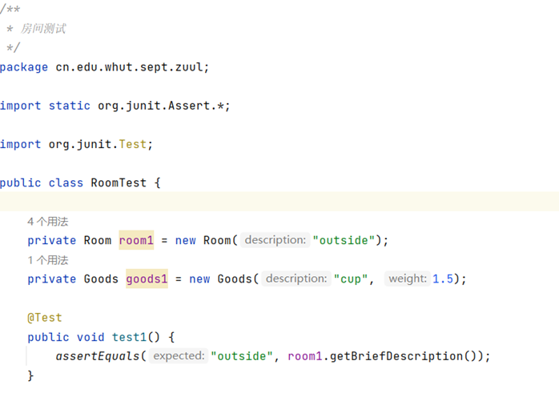